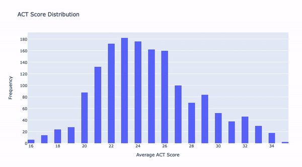
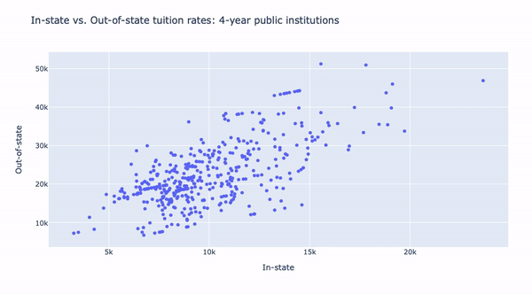
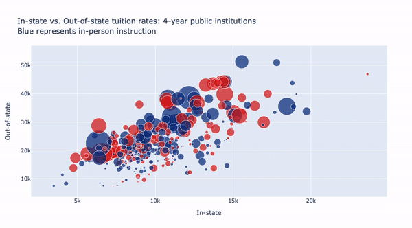
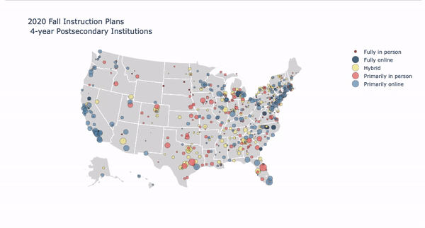
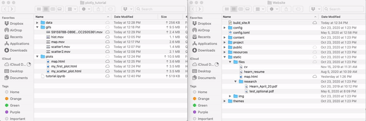

# Static Plots are *so* 2019: How to Create Interactive Plotly Graphs and Publish them to your Website using BlogDown

Many of the data visualization tools commonly utilized in the data science community (including ggplot, matplotlib, seaborn, etc.) do not offer robust interactive features. When working with data that can be easily interactive, I often rely on the Plotly Python package as an alternative. This article will provide an overview of Plotly, its key features, as well as a demonstration on how to use Plotly to display interesting, interactive graphs.

But wait, there's more! We'll be walking through the steps to publish your fancy new interactive graphs to your personal Blogdown website using the popular Blogdown package in R. 

## What is Plotly?

Plotly is a data vizualization tool available in multiple languages. The Plotly Python library is an open-source package of data visualizations often lauded for its customizations available. However, some of the syntax within Plotly can be confusing for a first-time user (or even a long-time user). Luckily, Plotly offers the Plotly Express library to help us create cool interactive visualizations with simpler syntax than the original Plotly package.

## Installing Plotly

We can install Plotly with the following magic command in Jupyter Notebook (to follow along, download the `tutorial.ipynb` above):


```python
!pip install plotly
```


Now that we've installed the package, we import it:


```python
# these are the packages we'll be working with today
import numpy as np
import plotly as py
import plotly.graph_objects as go
import pandas as pd
from plotly.offline import init_notebook_mode,iplot
import plotly.graph_objects as go
init_notebook_mode(connected=True)
```


Now we're ready to work with some real data! For this exercise, we'll be using data from a research project of mine: mapping Fall 2020 modes of instruction of 4-year colleges and universities, which is available on my GitHub in this repository:


```python
dta = pd.read_csv('covid_college.csv')

# just the data we need
#dta = dta[['institution', 'lat', 'lon', 'act_avg', 'adm_rate', 'online','enrollment', 'endowment', 'public']]

dta.head(5)
```

<table border="1" class="dataframe">
  <thead>
    <tr style="text-align: right;">
      <th></th>
      <th>unitid</th>
      <th>institution</th>
      <th>state</th>
      <th>enrollment</th>
      <th>public</th>
      <th>private</th>
      <th>sat_avg</th>
      <th>act_avg</th>
      <th>perc_oos</th>
      <th>perc_sor</th>
      <th>...</th>
      <th>sen_rep</th>
      <th>house_dem</th>
      <th>house_rep</th>
      <th>gov_dem</th>
      <th>gov_rep</th>
      <th>avg_cpc_jul</th>
      <th>in_person</th>
      <th>online</th>
      <th>hybrid</th>
      <th>policy</th>
    </tr>
  </thead>
  <tbody>
    <tr>
      <th>0</th>
      <td>222178</td>
      <td>Abilene Christian University</td>
      <td>TX</td>
      <td>3525.0</td>
      <td>0</td>
      <td>1</td>
      <td>1129.0</td>
      <td>24.0</td>
      <td>0.13</td>
      <td>0.32</td>
      <td>...</td>
      <td>0.612903</td>
      <td>0.440000</td>
      <td>0.560000</td>
      <td>0</td>
      <td>1</td>
      <td>28.581084</td>
      <td>1</td>
      <td>0</td>
      <td>0</td>
      <td>Primarily in person</td>
    </tr>
    <tr>
      <th>1</th>
      <td>222831</td>
      <td>Angelo State University</td>
      <td>TX</td>
      <td>9046.0</td>
      <td>1</td>
      <td>0</td>
      <td>1051.0</td>
      <td>21.0</td>
      <td>0.03</td>
      <td>0.03</td>
      <td>...</td>
      <td>0.612903</td>
      <td>0.440000</td>
      <td>0.560000</td>
      <td>0</td>
      <td>1</td>
      <td>54.070145</td>
      <td>0</td>
      <td>0</td>
      <td>1</td>
      <td>Hybrid</td>
    </tr>
    <tr>
      <th>2</th>
      <td>222983</td>
      <td>Austin College</td>
      <td>TX</td>
      <td>1294.0</td>
      <td>0</td>
      <td>1</td>
      <td>1213.0</td>
      <td>26.0</td>
      <td>NaN</td>
      <td>0.17</td>
      <td>...</td>
      <td>0.612903</td>
      <td>0.440000</td>
      <td>0.560000</td>
      <td>0</td>
      <td>1</td>
      <td>9.638675</td>
      <td>1</td>
      <td>0</td>
      <td>0</td>
      <td>Primarily in person</td>
    </tr>
    <tr>
      <th>3</th>
      <td>223232</td>
      <td>Baylor University</td>
      <td>TX</td>
      <td>14108.0</td>
      <td>0</td>
      <td>1</td>
      <td>1293.0</td>
      <td>29.0</td>
      <td>0.33</td>
      <td>0.34</td>
      <td>...</td>
      <td>0.612903</td>
      <td>0.440000</td>
      <td>0.560000</td>
      <td>0</td>
      <td>1</td>
      <td>40.953763</td>
      <td>0</td>
      <td>0</td>
      <td>1</td>
      <td>Hybrid</td>
    </tr>
    <tr>
      <th>4</th>
      <td>226091</td>
      <td>Lamar University</td>
      <td>TX</td>
      <td>8697.0</td>
      <td>1</td>
      <td>0</td>
      <td>1054.0</td>
      <td>21.0</td>
      <td>0.02</td>
      <td>NaN</td>
      <td>...</td>
      <td>0.612903</td>
      <td>0.440000</td>
      <td>0.560000</td>
      <td>0</td>
      <td>1</td>
      <td>45.598425</td>
      <td>1</td>
      <td>0</td>
      <td>0</td>
      <td>Primarily in person</td>
    </tr>
  </tbody>
</table>
<p>900 rows × 45 columns</p>


## Simple, interactive graphs in Plotly

Before we get into the more complicated GIS graphs (using the lat/long data), we'll start with some simpler ones. Like a **histogram**:

We'll be plotting the distribution of ACT scores in my sample of institutions:


```python
# the data
data = [go.Histogram(x=dta['act_avg'],
                     nbinsx=40,
                     histnorm='density')]

# the layout 
layout = go.Layout(title="ACT Score Distribution",
                  xaxis=dict(title = 'Average ACT Score'),
                  yaxis=dict(title = 'Frequency'))

# the figure
fig = go.Figure(data = data,layout = layout)

#plot the figure
iplot(fig)

#save the figure
py.offline.plot(fig, filename='plots/my_first_plot.html')
```




We saved the graph to our local dictionary as an `.html` file, so we will soon post it to our fancy blogdown website!

Now we can do a **scatter plot**: Let's look at the relationship between in-state and out-of-state tuition rates for public universities:


```python
pub = dta[dta['public'] == 1]

data = [go.Scatter(x=pub['tuition_in'],
                   y=pub['tuition_out'],
                   text = pub['institution'],
                   mode = 'markers')]

# the layout 
layout = go.Layout(title="In-state vs. Out-of-state tuition rates: 4-year public institutions",
                  xaxis=dict(title = 'In-state'),
                  yaxis=dict(title = 'Out-of-state'))

# the figure
fig = go.Figure(data = data,layout = layout)

#plot the figure
iplot(fig)

#save the figure
py.offline.plot(fig, filename='plots/my_scatter_plot.html')
```



Getting the hang of it? Pretty neat, right. Now we're ready for some more complicated graphs. But we could do better. 

Let's replicate the graph above to include colors for institutions that were fully online this Fall, as well as size by enrollment. 


```python
pub = dta[dta['public'] == 1] # subset to only include public institutions


data = [go.Scatter(x=pub['tuition_in'],
                   y=pub['tuition_out'],
                   text = pub['institution'],
                   mode = 'markers',
                   marker=dict(size=pub['enrollment']/1000, # we need to scale this variable 
                               color=pub['online'],
                               colorscale = "Portland", # 
                               showscale=False))] 

# the layout 
layout = go.Layout(title="In-state vs. Out-of-state tuition rates: 4-year public institutions <br>\
                          Blue represents in-person instruction",
                  xaxis=dict(title = 'In-state'),
                  yaxis=dict(title = 'Out-of-state'))

# the figure
fig = go.Figure(data = data,layout = layout)

#plot the figure
iplot(fig)

#save the figure
py.offline.plot(fig, filename='plots/my_scatter_plot.html') # overwriting the previous file because
                                                      # this one is obviously better
```



## Creating interactive GIS Bubble Plots in Plotly
Now that we're dynamic plot pros, we're ready to move on the big challenge: creating a GIS map of policy decisions by institution. Though it looks challenging, it's not too challenging once you understand what's going on "under the hood" in Plotly (which is what we've been practicing!). 

First, we need to do a few preprocessing steps to get the data the way we want it. You know how we hovered each bubble above and the institution name came up? What if we wanted to add enrollment and policy decision to that as well? We create a new feature, `text` to capture this information.


```python
dta['text'] = dta['institution'] \
             + '<br>UG Enrollment ' \
             + dta['enrollment'].astype(str) \
             + '<br>' + dta['policy'].astype(str)

```

Since we're working with a categorical outcome variable (`policy`), we need to do some special formatting. It will involve some list comprehension, and can get pretty tricky. First we need to start by grabbing the location of each time policy "changes" in the dataframe, which we can do with the code below:


```python
#sort by policy
dta = dta[(dta['policy'] == "Fully in person") | \
    (dta['policy'] == "Fully online") | \
    (dta['policy'] == "Hybrid") | \
    (dta['policy'] == "Primarily in person") | \
    (dta['policy'] == 'Primarily online')]

dta = dta.sort_values(by = ['policy'])

loc = 0
changes = []
policies = []
for row in dta.itertuples():
    if row.policy not in policies:
        policies.append(row.policy)
        changes.append(loc)
    loc = loc + 1
    
print("Policies:", policies)
print("Changes:", changes)
```

    Policies: ['Fully in person', 'Fully online', 'Hybrid', 'Primarily in person', 'Primarily online']
    Changes: [0, 17, 98, 328, 575]


This means we get a new policy in the data on rows 17, 98, 328, 575, and 850. To create our color scale, we need to make sure each of these "switches" are accounted for, which we want to do with a list of tuples. This should do the trick:


```python
i = 0
limits = []
for x in changes:
    if i != len(changes)-1:
        limits.append((x, changes[i+1]-1))
    else:
        limits.append((x, dta.shape[0])) # till the end of the dataframe
    i = i + 1
                      
limits
```


    [(0, 16), (17, 97), (98, 327), (328, 574), (575, 850)]


Nailed it. Last step before we get to the fun part! We just need to now define the colors, based on our sorted list of policies above:


```python
colors = ["#780000", # fully in person
          "#00334f", # fully online
          "khaki", # hyrbid
          "#ea6867", # primarily in person
          "#6491b2"] # primarily online
```

Now we're ready to plot our beautiful new map.


```python
scale = 400

fig = go.Figure()

for i in range(len(limits)): # looping over each policy
    lim = limits[i] 
    dta_sub = dta[lim[0]:lim[1]] # subsetting the data to get the policy we want
    fig.add_trace(go.Scattergeo( #notice Scattergeo, which is used for GIS data
        locationmode = 'USA-states', # this can be changed to "world"
        lon = dta_sub['lon'], #longitude
        lat = dta_sub['lat'], # latitude
        text = dta_sub['text'], # text variable we defined earlier
        marker = dict( # same marker syntax we worked with above!
            size = dta_sub['enrollment']/scale, # we defined this above
            color = colors[i],
            line_color='rgb(40,40,40)',
            line_width=0.5,
            sizemode = 'area'
        ),
        name = policies[i]))

fig.update_layout(
        title_text = '2020 Fall Instruction Plans<br> \
                      4-year Postsecondary Institutions',
        showlegend = True,
        geo = dict(
            scope = 'usa',
            landcolor = 'rgb(217, 217, 217)', #multiple ways to define colors!
        )
    )

fig.show()
fig.write_html("plots/map.html")
```



And now we have an awesome interactive map of the United States, along with policy decisions of each 4-year institution in the data set. Beautiful!

So, now what? We can't just print this out and have the same features. What if you wanted to show it to your friends so they can hover over their tiny alma mater? To share it with our friends, we must host it to a website. Now on to **Part II: Publishing your Graphs.** 

# Publishing your Interactive Plotly Graphs using Blogdown

Before I get into this section, I'll preface by saying that you need to have already set up your personal website using Blogdown. Blogdown is an increasingly popular package utilized within RStudio that allows you to build your own website. For whatever reason, Blogdown is particularly popular within Data Science communities.

In many instances, this is hosted on github.io, but it is possible to re-route it to your personal domain name. For example, I have already set up blogdown and uploaded my personal content to www.achearn.com.

For guidance on how to create your own website using Blogdown in R, I recommend this tutorial: https://bookdown.org/yihui/blogdown/

If you've worked with Blogdown in the past, you likely know about the `public` and `static` directories. To summarize, the `public` directory involves everything needed to build the site, and is often linked to its own GitHub repository. This is where the "magic" happens and your website is published. The static directory, on the other hand, contains all the files you want to publicize on your website. A typical Blogdown folder looks like the following:

[](dir.gif)


If you noticed above, we were saving each of our interactive visualizations in `.html` format along the way in a special `plots` folder within the working directory. This is where all of these graphs are saved. 

Now we just need to drag these graphs into our `static` directory in our `Website` folder (or, if you wanted to, you could have saved these graphs directly to the static folder!). 



If you know Blogdown, you know you have to build your site using a special R script before pushing your changes to GitHub. We can do this with the R code below:

```{r}
blogdown::build_site(local=FALSE)
```

Last step! We just need to add, commit, and push our changes to Github using the `public` directory, which is now updated to include our new graphs after we just ran the `build_site()` command above.

```linux
git add --all
git commit -m "adding plotly tutorial"
git push origin master
```

And viola! Our new graphs are now published online so you can send your friends or clints interactive graphs:

- **Histogram:** https://www.achearn.com/files/my_first_plot.html

- **Bar Chart:** https://www.achearn.com/files/my_scatter_plot.html

- **Map:** https://www.achearn.com/files/map.html

I hope this tutorial has been useful for teaching users how to use Plotly, its key features, and how to utilize the package alongside Blogdown to create interactive visualizations to publish online.
